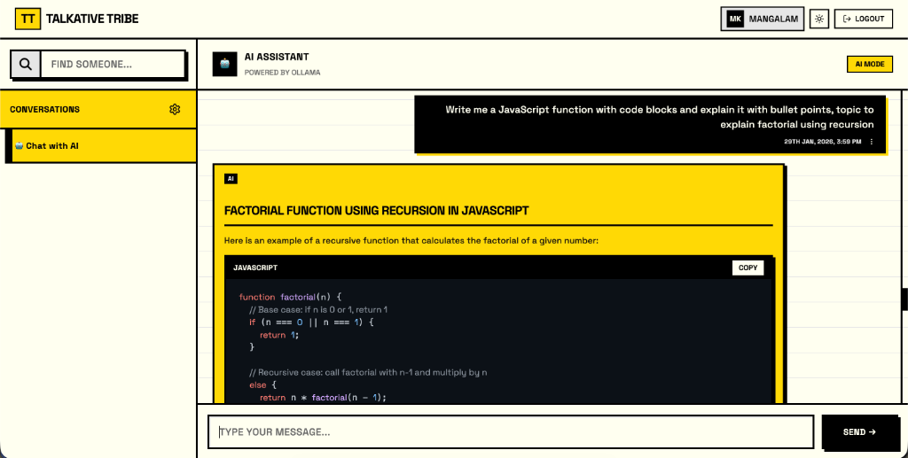
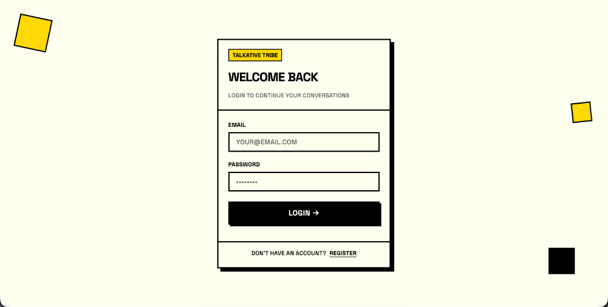
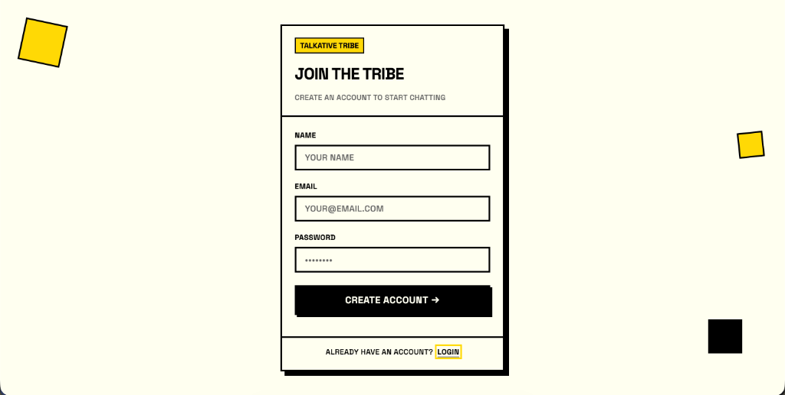

# Talkative Tribe

## Overview

Talkative Tribe is a real-time chat application designed to facilitate seamless communication among users. Built with modern web technologies, Talkative Tribe ensures a responsive, fast, and interactive user experience.

## Tech Stack

- **Frontend**:
  - React.js
  - TypeScript
  - Shadcn
  - TailwindCSS
  - Recoil
- **Backend**:
  - Prisma
  - MongoDB
  - Socket.io
  - Zod
  - Node.js
  - Express.js

## Features

- Real-time messaging
- User authentication and authorization
- Group chats
- Direct messages
- Media sharing (images, videos)
- Emojis and reactions
- Read receipts
- Online/offline status indicators

## Screenshots

### Chat Interface



### Login



### Sign Up



## Installation

### Prerequisites

Before you begin, ensure you have the following installed:

- Node.js (v14 or higher)
- npm (v6 or higher) or yarn (v1.22 or higher)
- MongoDB (v4 or higher)

### Steps

1. **Clone the repository**:

    ```sh
    git clone https://github.com/Abhi0049k/talkative-tribe.git
    cd talkative-tribe
    ```

2. **Install dependencies**:

    Using npm:

    ```sh
    npm install
    ```

    Or using yarn:

    ```sh
    yarn install
    ```

3. **Start the Database**:

    If you don't have MongoDB installed locally, you can run it via Docker (it includes the necessary replica set configuration):

    ```sh
    docker-compose up -d mongodb
    ```

4. **Set up environment variables**:

    Create a `.env` file in the root directory of both the backend and frontend and add the following variables:

    **Backend** `.env` file:

    ```env
    PORT=8998
    DATABASE_URL="mongodb://127.0.0.1:27017/talkative-tribe?directConnection=true"
    SALT_ROUNDS="Enter salt rounds"
    JWT_SECRET_KEY="Enter secret key"
    ```

    Note: If using Docker for DB, use `mongodb://localhost:27017/talkative_drive?directConnection=true&replicaSet=rs0`.

    **Frontend** `.env` file:

    ```env
    VITE_BACKEND_SERVER_URL="http://localhost:8998/"
    ```

    Alternatively, you can copy the `.env.example` file present in both the frontend and backend folders:

    ```sh
    cp backend/.env.example backend/.env
    cp frontend/.env.example frontend/.env
    ```

5. **Run the application**:

    Using npm:

    ```sh
    npm run dev
    ```

    Or using yarn:

    ```sh
    yarn dev
    ```

    The application will be available at `http://localhost:5173`.

## Folder Structure

```
talkative-tribe/
├── backend/            # Backend source code
│   ├── src/            # Backend source files
│   ├── prisma/         # Prisma schema and migrations
│   ├── .env.example    # Backend environment variables example
│   └── ...
├── frontend/           # Frontend source code
│   ├── src/            # Frontend source files
│   ├── .env.example    # Frontend environment variables example
│   └── ...
├── common/             # Common types and utilities
│   ├── src/            # TypeScript types
│   └── ...
└── README.md
```

## Usage

### Authentication

Users can sign up and log in using their email and password. Will soon be adding Google OAuth for authentication.

### Messaging

Users can create new chats, join existing ones, and send messages in real-time. Messages are stored in MongoDB and are instantly available to all participants.

### Real-time Communication

Real-time communication is handled using Socket.io, ensuring that messages and updates are delivered instantly to all connected clients.

### State Management

Recoil is used for efficient and scalable state management in the application, allowing for a responsive user interface.

### Data Validation

Zod is used for schema validation and ensures that the data being sent and received meets the expected structure, providing type safety and error handling.

### Media Sharing

Users can share images and videos within the chat. Uploaded media files are stored in a cloud storage service and are accessible directly in the chat interface.

## 🐳 Run with Docker (Recommended)

You can run the entire application (Frontend, Backend, and Database) with a single command.

### Prerequisites

- Docker & Docker Compose installed.

### Steps

1. **Clone the repository**:

    ```sh
    git clone https://github.com/Abhi0049k/talkative-tribe.git
    cd talkative-tribe
    ```

2. **Run with Docker Compose**:

    ```sh
    docker-compose up --build
    ```

3. **Access the App**:
    - Frontend: [http://localhost:5173](http://localhost:5173)
    - Backend API: [http://localhost:8998](http://localhost:8998)

> **Note**: The default Docker setup uses a pre-configured PostgreSQL user/pass defined in `docker-compose.yml` for convenience. For production, please change these credentials.

## Contributing

We welcome contributions! Please follow these steps to contribute:

1. Fork the repository.
2. Create a new branch: `git checkout -b feature/your-feature-name`.
3. Make your changes and commit them: `git commit -m 'Add some feature'`.
4. Push to the branch: `git push origin feature/your-feature-name`.
5. Open a pull request.

## Contact

For any questions or feedback, please reach out to us at [mangalam0015k@gmail.com]
