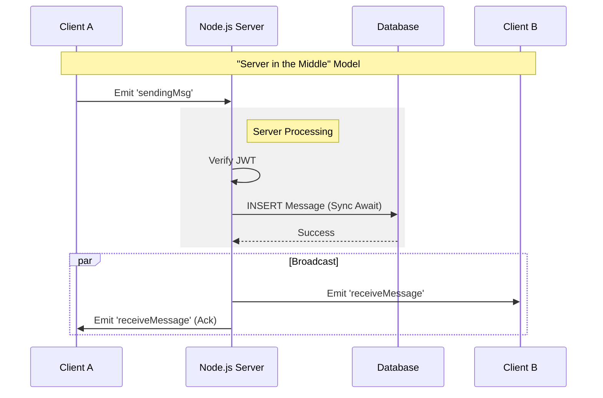
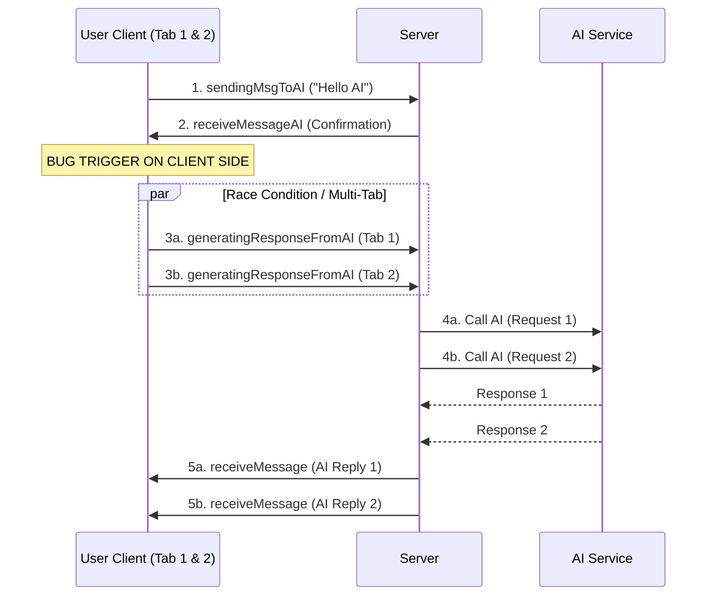

# Application Architecture

## 1. High-Level Overview
The application follows a standard **Client-Server-Database** model with real-time capabilities powered by **Socket.io**.

*   **Frontend**: React (Vite) + Tailwind CSS.
*   **Backend**: Node.js + Express (HTTP) + Socket.io (WebSockets).
*   **Database**: PostgreSQL + Prisma ORM.

---

## 2. Current Architecture: "Server in the Middle"

### Concept
All chat messages are routed through the central server. The server acts as the obligatory "Middleman" for all interactions.

### Data Flow Diagram

### Advantages & Disadvantages

| Feature | Advantage | Disadvantage |
| :--- | :--- | :--- |
| **Centralization** | Simple to implement. Single source of truth. Easy to moderate content. | **Bottleneck**: Server processes 100% of traffic.   **Single Point of Failure**: If server dies, chat dies. |
| **Data Storage** | All history is saved reliably in Postgres. Users can switch devices and see history. | **Privacy**: Server admin can read all messages (No E2EE).   **Cost**: High DB storage and bandwidth costs. |
| **Protocol** | WebSockets are widely supported and reliable. | **Latency**: "Double Hop" (Client -> Server -> Client) is slower than P2P. |

---

## 3. "Chat with AI" Architecture & The Double-Response Bug

### Current Implementation (The "Ping-Pong" Flow)
The current implementation relies on a multi-step round-trip between Client and Server to generate an AI response. This is the root cause of the **Double Response Bug**.

### Visualizing the Bug

### Why does this happen?
The trigger for the AI response (Step 3) happens on the **Client Side**.
*   **Scenario A (Multiple Tabs)**: If you have the app open in 2 tabs, *both* tabs receive confirmation of your message. *Both* tabs then run the code to tell the server "Go generate a reply".
*   **Scenario B (Re-renders)**: If the React component re-mounts, it might fire the event twice.

### Solution: Server-Side Orchestration
The client should **never** be responsible for telling the server "now reply". The server should handle this internally.

**Correct Usage:**
1.  **Client** sends message.
2.  **Server** receives message -> Saves to DB -> **Calls LLM immediately** (internal function).
3.  **Server** emits AI response when ready.

---

## 4. Improvement Roadmap
1.  **Fix AI Flow**: Move `chatWithAI` logic into the `sendingMsgToAI` handler on the backend. Remove the `generatingResponseFromAI` event entirely.
2.  **Performance**: Make DB writes asynchronous so the UI doesn't freeze while waiting for Prisma.
3.  **Scalability**: Implement Redis Adapter for Socket.io to allow multiple server instances.
